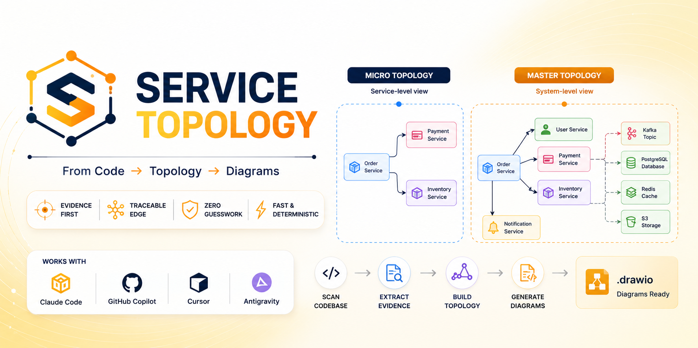

<div align="center">



<br>

[](LICENSE)
[](https://github.com/arav7781/service-topology/actions/workflows/ci.yml)
[](#supported-hosts)
[](#requirements)
[](skills/topology-cartographer/scripts/requirements.txt)
[](#safety-model)

**[Quick start](#quick-start)** · **[Hosts](#supported-hosts)** · **[Usage](#usage)** · **[What you get](#what-you-get)** · **[How it works](#how-it-works)** · **[Safety](#safety-model)** · **[Limitations](#limitations)**

</div>

---

Point Topology Cartographer at a repository and it tells you what actually
talks to what — every Kafka producer and consumer, every REST and gRPC call,
every external system — with every arrow tracing to a `path/to/file:LINE` you
can open and check.

**It draws diagrams. It never guesses an arrow.**

```text
   ┌──── extract ─────┐   ┌──── one cited graph ────┐   ┌── render ──┐
   │ @KafkaListener   │   │  services · topics      │   │  .drawio   │
   │ kafkaTemplate    │──▶│  edges, each with a     │──▶│  .mmd      │
   │ requests · axios │   │  file:line and a tag    │   │  evidence  │
   │ .proto · openapi │   └─────────────────────────┘   └────────────┘
   │ application.yml  │      unresolved targets are          ▲
   └──────────────────┘      dropped, not guessed  ──────────┘
```

<details>
<summary><b>Contents</b></summary>

- [Why it exists](#why-it-exists)
- [What it does not do](#what-it-does-not-do)
- [Core capabilities](#core-capabilities)
- [Supported hosts](#supported-hosts)
- [Quick start](#quick-start)
- [Installation](#installation)
- [Usage](#usage)
- [What you get](#what-you-get)
- [How it works](#how-it-works)
- [The human workflow](#the-human-workflow)
- [Safety model](#safety-model)
- [Limitations](#limitations)
- [Troubleshooting](#troubleshooting)
- [Project structure](#project-structure)
- [Contributing](#contributing)
- [Roadmap](#roadmap)
- [Licence](#licence)

</details>

---

## Why it exists

An event-driven system's structure is spread across the thing it describes. A
topic name appears in a Go producer, a Python consumer, a third service's
`application.yml`, and a Terraform resource in another repository — and no
single file states the relationship that matters. So diagrams get drawn by
hand, drift within weeks, and get replaced by the knowledge of whoever has
been there longest.

Ask an assistant to draw it instead and you get something plausible, partly
invented, with no way to tell which parts. This tool exists because the fix is
structural: every arrow cites a line, and the arrows that could not be
resolved are drawn **dashed and grey** so you can see the uncertainty in the
picture rather than take it on faith.

## What it does not do

- **No custom renderer.** `.drawio` is already rendered by an extension that
  works in VS Code, Cursor, and Antigravity. Building a webview would be a
  worse version of a solved problem.
- **No LLM-written XML.** Generation is a deterministic script, from a
  structured input. A model hand-writing mxGraph is the same failure one layer
  down.
- **No runtime observation.** No broker connection, no service registry, no
  distributed trace. A live environment is not evidence you can cite, and this
  tool was never authorised to touch one.
- **No guessed edges.** A call whose target does not resolve is left out. A
  missing arrow is a gap a reader can detect; a wrong arrow is not.
- **No writing to the analysed repository** — including its `.gitignore`.
- **No implementation.** It reports the topology it finds. Redesigning the
  system is a separate, human decision.

## Core capabilities

| | |
|---|---|
| **Kafka, five ecosystems** | Spring Kafka, Kafka Streams and the JVM client · kafka-python, confluent-kafka, aiokafka, faust · kafkajs, node-rdkafka, NestJS · segmentio/kafka-go, sarama · Spring Cloud Stream bindings |
| **Synchronous calls** | OpenAPI specs · `.proto` plus generated-stub usage · requests/httpx · axios/fetch/got · RestTemplate/WebClient/OkHttp/Feign · net/http, resty |
| **Config resolution** | A topic named `${app.topics.orders}` is followed into `application.yml`, `.env`, docker-compose, Helm values, or Terraform — and stays `[CODE]`, because both ends were read |
| **Two levels of detail** | One master topology for the whole system; one micro topology per service, with message keys, consumer groups, and method+path |
| **Visible uncertainty** | `[CODE]` renders solid; `[INFERENCE]` renders dashed grey, carries a written reason, and is listed separately |
| **Evidence inside the file** | Every node and edge is a `UserObject` — select an arrow in draw.io, `Edit > Edit Data`, and read its source location |
| **Byte-identical re-runs** | No timestamps, content-hashed diagram ids, total ordering everywhere. A diff of two runs is a diff of two architectures |
| **Zero dependencies** | Subset-YAML instead of PyYAML, a layered DAG placement instead of graphviz, `ElementTree` instead of string-formatted XML |

## Supported hosts

| Host | How it runs | Rendering |
|---|---|---|
| **Claude Code** | Native skill (`skills/topology-cartographer/`) | `.drawio` via the `hediet.vscode-drawio` extension when Claude Code runs inside VS Code; `.mmd` fallback always |
| **GitHub Copilot** | Native skill (`.github/skills/topology-cartographer/`) | Runs inside VS Code, so the same extension previews the `.drawio` once it lands on disk |
| **Cursor** | Skill (`.cursor/skills/`) + MCP server | Same extension, from Cursor's marketplace or OpenVSX |
| **Antigravity** | Skill (`.agents/skills/`) + MCP server | Same extension; Antigravity is a VS Code-compatible extension host |

Cursor and Antigravity get both a skill tree and an MCP server: the skill gives
their agent the workflow and the hard constraints, the server gives it
callable tools. Neither alone is enough — see
[Installation](#installation).

## Quick start

```bash
S=skills/topology-cartographer/scripts

python3 $S/scan_repository.py /path/to/repo --format summary      # who is here?
python3 $S/scan_repository.py /path/to/repo -o /tmp/scan.json
python3 $S/build_graph_model.py --input /tmp/scan.json \
    -o service-topology/graph-model.json \
    --evidence-out service-topology/evidence/sources.md
python3 $S/layout_graph.py service-topology/graph-model.json \
    -o service-topology/graph-model.laid-out.json
python3 $S/render_drawio.py service-topology/graph-model.laid-out.json \
    --mode all --output-dir service-topology
python3 $S/render_mermaid.py service-topology/graph-model.laid-out.json \
    --mode all --output-dir service-topology
python3 $S/validate_graph_model.py service-topology/graph-model.json \
    --repo /path/to/repo
```

Or just say it: *"use the topology-cartographer skill in scan mode on this
repository"*. Start with `scan` — it is cheap, and its service list is what
tells you which micro topology is worth generating first.

Try it on the bundled fixture without any repository of your own:

```bash
python3 skills/topology-cartographer/scripts/scan_repository.py \
    examples/fixture-mesh --format summary
```

### Requirements

- Python 3.8 or later. Nothing else — the scripts are standard-library only.
- To *view* a `.drawio` file: the `hediet.vscode-drawio` extension in VS Code,
  Cursor, or Antigravity. Not required to generate one, only to see it
  rendered instead of as raw XML.

## Installation

### Claude Code

**Option A — as a plugin.** Add this repository as a marketplace and install
the plugin:

```text
/plugin marketplace add arav7781/service-topology
/plugin install topology-cartographer@arav7781
```

**Option B — clone and point at it directly.** Clone this repository anywhere,
then reference `skills/topology-cartographer/SKILL.md` from your project's
`CLAUDE.md`, or copy the `skills/topology-cartographer/` directory into your
own project's `.claude/skills/`.

**Option C — global skill.** Copy `skills/topology-cartographer/` into
`~/.claude/skills/topology-cartographer/` to make it available in every
project.

### GitHub Copilot

Copy `.github/skills/topology-cartographer/` and
`.github/agents/{topology-extractor,graph-layout-validator}.agent.md` into the
repository you want to invoke Copilot from — Copilot Chat reads skills from
`.github/skills/` in the current workspace.

### Cursor and Antigravity

Both need the skill tree *and* the MCP server:

1. Copy `.cursor/skills/topology-cartographer/` (or `.agents/skills/…` for
   Antigravity) and the matching `agents/*.md` files into your project.
2. Point the host's MCP config at this checkout:

| Host | Config file | Points at |
|---|---|---|
| Cursor | `.cursor/mcp.json` | `mcp-server/topology_mcp_server.py` |
| Antigravity | `.agents/mcp_config.json`, or `~/.gemini/config/mcp_config.json` globally | `mcp-server/topology_mcp_server.py` |

This repository's own `.cursor/mcp.json` and `.agents/mcp_config.json` already
point at `mcp-server/` via `${workspaceFolder}`, which only resolves correctly
when *this* repository is the open workspace. To use the server from a
different repository, copy the block and replace `${workspaceFolder}` with an
absolute path to this checkout:

```json
{
  "mcpServers": {
    "topology-cartographer": {
      "command": "python3",
      "args": ["/ABSOLUTE/PATH/TO/service-topology/mcp-server/topology_mcp_server.py"]
    }
  }
}
```

Full detail, including the four MCP tools and their arguments:
[mcp-server/README.md](mcp-server/README.md).

### Rendering, all hosts

Install `hediet.vscode-drawio` in VS Code, Cursor, or Antigravity.
[`.vscode/extensions.json`](.vscode/extensions.json) recommends it and your
editor will prompt on open. **Recommend, never auto-install** — extensions do
not uniformly have permission to install other extensions across these hosts.

### 60 seconds to a first run

```bash
git clone https://github.com/arav7781/service-topology
cd service-topology
python3 skills/topology-cartographer/scripts/scan_repository.py \
    examples/fixture-mesh --format summary
```

## Usage

| Mode | What it does |
|---|---|
| `scan` | Extract bindings and build the graph model. No diagrams. **Run this first.** |
| `master` | The whole-system diagram |
| `micro <service>` | One service's neighbourhood, with full label detail |
| `all` | Master plus one micro topology per service |
| `refresh` | Re-scan and re-render after code changes |

> *"Use the topology-cartographer skill in scan mode."*
> *"Which services consume `orders.created`?"*
> *"Draw me the micro topology for billing-svc."*
> *"What breaks if I change the key on `orders.created`?"*

If the repository has more than roughly 5,000 source files, or `scan` reports
more than 25 services, the skill asks which subsystems to focus on before
running `all` — twenty-five micro topologies nobody asked for is not a
deliverable.

## What you get

```text
service-topology/
├── master-topology.drawio        the whole system
├── master-topology.mmd           Mermaid fallback, same content
├── graph-model.json              the structured source of truth
├── graph-model.laid-out.json     the model plus diagram coordinates
├── micro/
│   ├── orders-svc.drawio         one service's direct neighbourhood
│   └── orders-svc.mmd
└── evidence/
    └── sources.md                 every edge's tag and file:line
```

Worked output, generated from the bundled fixture and regenerable by anyone:
**[examples/sample-master-topology.md](examples/sample-master-topology.md)**
and
**[examples/sample-micro-topology.md](examples/sample-micro-topology.md)**.

### What a diagram actually shows

The default `streams` theme draws the Kafka Streams dataflow idiom, where
**kind is carried by shape rather than by fill** — at three hundred nodes a
reader never stops telling a circle from a diamond, and leaving fill unset lets
the diagram follow draw.io's own light or dark setting.

- **Circle** — a Kafka topic
- **Grey dashed circle** — a topic whose name is an unresolved config reference
- **Diamond** — a service, the processor between two topics
- **Grey dashed diamond** — a service known only because something calls it,
  with no manifest found in this repository
- **Cylinder** — a datastore (purple: a cache)
- **Off-page connector** — an external API
- **Solid arrow** — `[CODE]`, read directly
- **Dashed grey arrow** — `[INFERENCE]` or `[UNVERIFIED]`, not confirmed

Pass `--theme classic` to `layout_graph.py` and `render_drawio.py` for the
label-fitted boxes this skill drew before themes existed — blue service, orange
topic hexagon, grey external cloud — which is more compact for a small graph.
A theme fixes node sizes as well as styles, so the layout stamps its theme into
the model and the renderers follow it; see
[drawio-xml-spec.md](skills/topology-cartographer/references/drawio-xml-spec.md).

## How it works

Six phases, each with an artefact and a gate — the full version is
[docs/workflow.md](docs/workflow.md):

| Phase | Produces | Gate |
|---|---|---|
| 0 Scope and boundaries | Service list, one of three decisions | Are these the right services? |
| 1 Extraction | Cited facts, `[CODE]` or `[INFERENCE]` | Large repository — which subsystems? |
| 2 Graph model | `graph-model.json`, `evidence/sources.md` | `scan` mode ends here |
| 3 Layout | Deterministic coordinates | — |
| 4 Render | `.drawio` and `.mmd` | — |
| 5 Validation | Every citation re-read against the code | Does this match how the system behaves? |

The model never hand-computes a coordinate and never hand-writes XML.
Coordinates come from `layout_graph.py`; XML comes from `render_drawio.py`.
Boundaries are settled *before* extraction, because every edge is a statement
about services and a wrong boundary makes every edge wrong — a modular
monolith, or a system whose deployables are defined only in Helm, stops the
run and asks rather than guessing.

## The human workflow

1. **Run `scan`.** Look at the service list before anything else. If it is
   wrong, stop.
2. **Generate the micro topology for a service you know well.** Check it. That
   calibrates how much to trust the rest.
3. **Then generate the master**, now that you know the error rate.
4. **Read `evidence/sources.md`, inferred section first.** It is short by
   design and it is the only part that needs a decision.
5. **Re-run after code changes** rather than editing the diagram. A
   hand-edited diagram silently stops matching its evidence.

## Safety model

Read-only on the analysed repository, and it never contacts the system it
maps. [docs/safety-model.md](docs/safety-model.md) has the full model; the
short version:

| Denied | Why |
|---|---|
| Writing outside `service-topology/` | The analysed repository is read-only, including its `.gitignore` |
| Hand-editing a generated `.drawio` or `.mmd` | It decouples the diagram from the evidence that justifies it |
| `docker compose up`, `kubectl apply`, `terraform apply` | The system is mapped by reading it, not running it |
| `kafka-topics`, `kcat`, `psql`, `redis-cli` | A live broker is not a citation, and this run was not authorised to touch one |
| `pip install`, `npm install` | Standard library only — there is nothing to install |
| `git commit`, `push`, destructive shell | Mapping does not change history |

Containment is enforced **in code** by `SafeWriter` — a path-checked writer
that resolves symlinks and `..` on both sides of the comparison, so nothing
writes outside the output directory regardless of what any host or model
attempts. An optional [`hooks/topology_guard.py`](hooks/topology_guard.py)
turns the whole table into a pre-tool-use control across all four hosts; see
[hooks/README.md](hooks/README.md) for the trade-off before enabling it.

## Limitations

- **Static analysis only.** A topic chosen at runtime — per-tenant routing, a
  URL assembled from a database row — cannot be found by reading. It is
  reported as unresolvable rather than guessed.
- **The symbol table is file-local.** Chasing a base-URL constant across
  module boundaries by name alone produces confident nonsense in any
  repository with more than one `BASE_URL`.
- **Coverage has edges.** .NET, Ruby, PHP, and several framework abstractions
  are not covered yet — see the roadmap. An uncovered ecosystem is reported as
  a gap in the run summary, not hidden.
- **Generated code is skipped** (`*_pb2.py`, `*.pb.go`), so a binding that
  only exists there will not appear.
- **A diagram is not a system.** The tool reads code; you know production.
  The accuracy gate exists because the second half of that sentence is the
  one that catches real errors.

## Troubleshooting

<details>
<summary>The .drawio file opens as raw XML</summary>

The `hediet.vscode-drawio` extension is not installed, or the editor is not a
VS Code-family host. Install it and reopen the file — it renders on open, with
no command to run. In a surface with no file view at all, use the `.mmd`.
</details>

<details>
<summary>My Kafka client library was not recognised</summary>

Check
[kafka-extraction-playbook.md](skills/topology-cartographer/references/kafka-extraction-playbook.md)
for what is covered. If your library is genuinely missing, that is worth
reporting — and worth fixing in the playbook and the extractor rather than by
hand-adding an edge to the model, which the next run would overwrite.
</details>

<details>
<summary>The service boundaries are wrong</summary>

Phase 0 should have stopped and asked. Use `--scope` to name the directories
that really are services, and see
[service-boundary-heuristics.md](skills/topology-cartographer/references/service-boundary-heuristics.md).
A repository whose deployables are defined only in Kubernetes manifests
always needs this.
</details>

<details>
<summary>The repository is too large, or the diagram is unreadable</summary>

`--scope services/orders,services/billing` produces a readable diagram of the
part that matters. A forty-service master topology is honest and unreadable;
two eight-service ones are honest and useful. Micro topologies are the other
answer — that is why the mode exists.
</details>

<details>
<summary>The MCP server will not connect</summary>

Run it by hand: `python3 mcp-server/topology_mcp_server.py --version`. If that
works, the path in your config is wrong — `${workspaceFolder}` expands to the
*open* workspace, so a different repository needs an absolute path. Check
that `python3` is on the host's `PATH`, which is not always your shell's.
More in [mcp-server/README.md](mcp-server/README.md).
</details>

<details>
<summary>A topic node is labelled "(unresolved)"</summary>

The code refers to the topic by a config key whose value is not in the
repository — usually set by a deployment pipeline. That is a genuine finding,
not a bug: the topic name is not knowable from this code alone. The edge is
tagged `[INFERENCE]` and says so.
</details>

## Project structure

```text
service-topology/
├── README.md
├── LICENSE                          MIT
├── CONTRIBUTING.md                  how to contribute; the verification battery
├── Service_Topology_Mapping_Plan.md design source of truth
├── .claude-plugin/                  plugin + marketplace manifests
│
├── skills/topology-cartographer/    ← CANONICAL skill payload (Claude Code)
│   ├── SKILL.md                     phases, hard constraints, modes, gates
│   ├── references/                  7 extraction and rendering playbooks
│   ├── templates/                   4 schema and summary templates
│   └── scripts/                     6 stdlib-only entry points + topology_lib/
├── agents/                          2 Claude Code subagent definitions
│
├── .github/                         GitHub Copilot equivalents + CI
│   ├── skills/topology-cartographer/
│   ├── agents/*.agent.md
│   └── workflows/ci.yml             the verification battery, on every push/PR
├── .cursor/                         Cursor equivalents
│   ├── skills/topology-cartographer/
│   ├── agents/*.md
│   └── mcp.json                     MCP server registration
├── .agents/                         Antigravity equivalents
│   ├── skills/topology-cartographer/
│   ├── agents/*.md
│   └── mcp_config.json              MCP server registration
├── .vscode/
│   ├── extensions.json              recommends hediet.vscode-drawio
│   └── mcp.json                     MCP server registration
│
├── mcp-server/                      MCP layer for Cursor · VS Code · Antigravity
│   ├── topology_mcp_server.py       4 tools, JSON-RPC over stdio, stdlib only
│   └── test_client.py               a real MCP client, run in CI
├── hooks/                           optional guard hook, all four hosts
├── tools/sync_hosts.py              drift check across the four host trees
├── examples/                        worked output + the fixture it came from
│   ├── sample-master-topology.md
│   ├── sample-micro-topology.md
│   └── fixture-mesh/                3 synthetic services, Go · Python · TypeScript
└── docs/
    ├── architecture.md
    ├── workflow.md
    ├── output-format.md
    ├── safety-model.md
    └── implementation-roadmap.md
```

The [planning document](Service_Topology_Mapping_Plan.md) is the detailed
design source and is kept unchanged.

## Contributing

The full guide is **[CONTRIBUTING.md](CONTRIBUTING.md)**. The short version:
the most valuable contribution is a real repository this tool got wrong — a
missed binding, a false edge, a service boundary it misjudged.

- **Never invent an edge.** A change to an extractor must preserve the rule
  that an unresolved call is dropped, never guessed at.
- **Standard library only**, in `topology_lib/` and the scripts.
- **Determinism is a released guarantee.** Re-running the pipeline on
  unchanged code must produce byte-identical output.
- Run `tools/sync_hosts.py --write` after touching `references/`,
  `templates/`, or `scripts/` — the four host trees must stay byte-identical.

## Roadmap

| Version | Theme | Status |
|---|---|---|
| **V1** | Kafka (5 ecosystems) and REST/gRPC extraction, deterministic layout, `.drawio` + Mermaid rendering, four hosts, MCP server | Shipped |
| **V2** | Schema-registry awareness (Avro/Protobuf/JSON Schema), stale-diagram diffing, consumer-group topology, dead-letter recognition | Planned |
| **V3** | .NET, Ruby, PHP, Rust coverage; service-mesh and API-gateway config as an edge source; Kubernetes as a service-boundary source | Planned |
| **V4** | RabbitMQ, AWS SNS/SQS/EventBridge, Google Pub/Sub, Azure Service Bus | Planned |

Delivery detail, success metrics, and the quality-review questions any change
to extraction should pass:
[docs/implementation-roadmap.md](docs/implementation-roadmap.md).

## Licence

[MIT](LICENSE)
