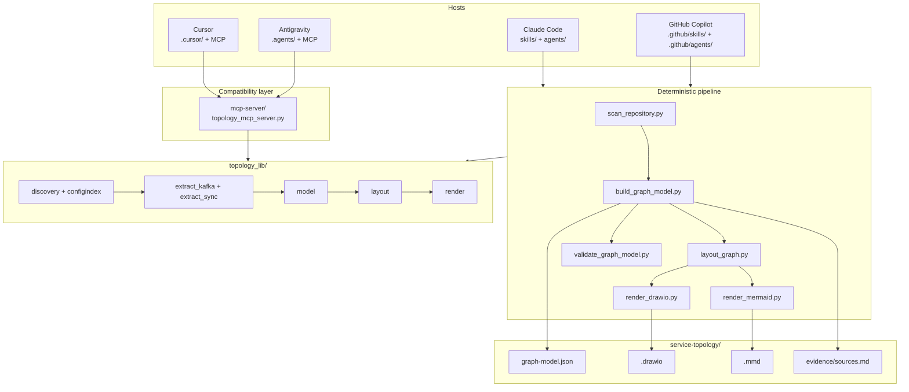

# Architecture

How Topology Cartographer is put together, and why. The short version: a
deterministic pipeline owns every fact and every coordinate, the model owns
judgement, and the two never swap jobs.

Companion to [`workflow.md`](workflow.md),
[`output-format.md`](output-format.md), and
[`safety-model.md`](safety-model.md).

---

## The problem the architecture solves

Ask an assistant to draw your architecture and it will draw one. It will look
plausible, it will be partly invented, and you will not be able to tell which
parts. The failure is not that the model is careless - it is that nothing in the
pipeline ever forced a claim to be traceable, and nothing made an unsupported
claim *look* different from a supported one.

Three consequences follow, and they shape everything below:

1. **Every arrow needs a citation.** `path/to/file:LINE`, read in this run. An
   edge without one does not get drawn.
2. **Unsupported must look unsupported.** An inference renders dashed and grey
   and is listed separately. Evidence quality is visible at a glance or it may
   as well not exist.
3. **The model must not hold the pen.** An LLM writing mxGraph XML directly is
   the same failure one layer down: output that looks like a diagram, with no
   way to check it against anything. XML comes from a script, from a structured
   input, or it does not come at all.

---

## Component diagram

Read it as one rule: **every host reaches the same library, and only the library
produces output.**

---

## Components

| Component | Responsibility |
|---|---|
| `topology_lib/discovery.py` | Walk the repository, find service roots, attribute every file to one |
| `topology_lib/configindex.py` | Subset-YAML, `.properties`, `.env`, compose, Helm, Terraform - resolve the config a topic name or base URL actually lives in |
| `topology_lib/extract_kafka.py` | Producer and consumer bindings across five ecosystems |
| `topology_lib/extract_sync.py` | REST, gRPC, OpenAPI, and external systems |
| `topology_lib/model.py` | The graph model, evidence tags, deduplication, validation, and write containment |
| `topology_lib/layout.py` | Deterministic layered placement |
| `topology_lib/render.py` | mxGraph XML, Mermaid, and the evidence report |
| `scripts/*.py` | Six command-line entry points; argument handling only |
| `mcp-server/` | The same library over JSON-RPC, for hosts with no skill format |
| `skills/`, `agents/` and their mirrors | The model-facing half: when to run this, what to ask, what to refuse |

---

## Three structural decisions

### 1. Extraction produces facts, not conclusions

An extractor emits an edge with a citation and a tag. It never decides that a
service is "the core of the system", that a topic is "probably unused", or that
two similarly named things are the same thing. Those are readings of the data,
and they belong in the summary a human reviews - where they can be argued with.

The practical form of this rule is the drop: a call whose target cannot be
resolved produces **no edge**. Under-reporting is detectable by a reader who
knows the system. Mis-reporting is not.

### 2. Deterministic work belongs in scripts

Coordinates, XML, deduplication, and the evidence report are arithmetic and
serialisation. The model never computes them, exactly as it never hand-computes
a candidate score in contributor-scout.

This buys the property everything else rests on: **re-running the pipeline on
unchanged code produces byte-identical output**. A diff between two runs is a
diff between two architectures. Achieving it required removing every source of
incidental variation - no timestamps in the model or the XML, a content hash
rather than a UUID for the diagram id, sorted iteration everywhere, and a total
tie-break on node id in every layout sort.

### 3. The graph model is the only interface

Layout reads the model. Both renderers read the model. The evidence report reads
the model. The MCP server reads the model. Nothing downstream of
`build_graph_model.py` re-reads source, and nothing upstream knows what a
diagram looks like.

So a wrong edge has exactly one fix: change extraction and rebuild. Editing the
rendered diagram is not a fix, it is a lie with better formatting - which is why
the optional guard hook denies writes to a generated `.drawio` even inside the
output directory.

---

## Progressive disclosure

`SKILL.md` is loaded whenever the skill activates; everything else is loaded on
demand. The reference playbooks are the bulk of the domain knowledge - five
Kafka ecosystems, four HTTP client families, the gRPC two-phase resolution - and
none of it is needed until a phase needs it.

The bundled-resources table at the end of `SKILL.md` is the index: file, and the
phase that reads it. A run that never touches gRPC never loads the gRPC section.

---

## Host packaging

The same payload ships four times, once per host tree:

| Tree | Host | Frontmatter |
|---|---|---|
| `skills/topology-cartographer/` | Claude Code (canonical) | `name`, `description`, `allowed-tools` |
| `.github/skills/topology-cartographer/` | GitHub Copilot | `name`, `description`, `argument-hint` |
| `.cursor/skills/topology-cartographer/` | Cursor | `name`, `description` |
| `.agents/skills/topology-cartographer/` | Antigravity | `name`, `description` |

Agents follow the same pattern with per-host frontmatter and byte-identical
bodies: `tools: Read, Grep, ...` for Claude Code, `tools: [read, search,
execute]` plus `user-invocable: false` for Copilot, bare `name`/`description`
for Cursor, and `subagent: true` for Antigravity.

`references/`, `templates/` and `scripts/` are byte-identical in all four trees.
[`tools/sync_hosts.py`](../tools/sync_hosts.py) enforces that, and CI runs it.
Four copies drift; a check that they have not is the cheapest way to stop it.

Cursor and Antigravity get the skill tree *and* the MCP server. The tree gives
their agent the workflow and the constraints; the server gives it callable
tools. Neither is sufficient alone - a host that can call `scan_repository` but
has never read the hard-constraints section will happily be asked to edit the
diagram it just made.

---

## Data flow between phases

| Phase | Input | Output | Determinism |
|---|---|---|---|
| 0 Scope | repository path | service list, one of three decisions | Sorted walk |
| 1 Extraction | repository, config index | scan document with facts and citations | Sorted files, sorted extractors |
| 2 Graph model | one or more scan shards | `graph-model.json`, `evidence/sources.md` | Merge is order-independent |
| 3 Layout | graph model | `graph-model.laid-out.json` | Total tie-break on node id |
| 4 Render | laid-out model | `.drawio`, `.mmd` | No timestamps, content-hashed ids |
| 5 Validation | graph model, repository | pass/fail plus warnings | Re-reads every citation |

The shard boundary at phase 2 is what makes a monorepo tractable: the
`topology-extractor` subagent scans one subtree, returns a shard, and the
orchestrator merges. A 3,000-file repository never enters one context window.

---

## Where the design deliberately stops

- **No runtime observation.** No broker connection, no service registry, no
  distributed trace. Those would find edges static analysis misses, and would
  replace a citation you can audit with one you cannot, in an environment nobody
  authorised this run to touch.
- **No custom renderer.** draw.io already renders `.drawio` in every VS
  Code-family editor. Building a webview would be a worse version of a solved
  problem.
- **No inference about intent.** The tool reports that `orders-svc` publishes
  `orders.created`. Whether that is the right design is a conversation for
  people who know the business.
- **No auto-layout beyond one algorithm.** One layered placement, applied
  consistently. When a diagram is too dense the answer is `--scope` or a micro
  topology, not a cleverer algorithm.

---

## Related documents

- [`workflow.md`](workflow.md) - the phases in detail
- [`output-format.md`](output-format.md) - the output contract
- [`safety-model.md`](safety-model.md) - permissions and containment
- [`implementation-roadmap.md`](implementation-roadmap.md) - what ships when
- [`../Service_Topology_Mapping_Plan.md`](../Service_Topology_Mapping_Plan.md) - the design source of truth
