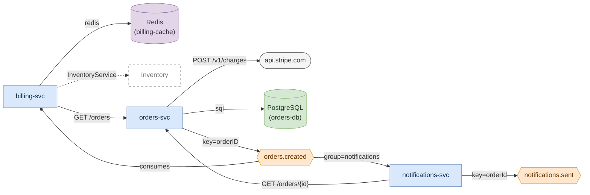

# Master topology - `fixture-mesh`

> **This is real output, not a mockup.** Everything below was produced by
> running `topology-cartographer` against [`fixture-mesh/`](fixture-mesh/) - a
> small synthetic three-service system that lives in this repository. Every
> file path and line number resolves to a file you can open. Regenerate it with
> the commands at the bottom.

**Scanned:** `examples/fixture-mesh`
**Files read:** 14
**Open in your editor:** `service-topology/master-topology.drawio`
**No drawio extension?** The Mermaid below is the same content.

| | |
|---|---|
| Services | 4 (3 declared, 1 referenced only) |
| Kafka topics | 2 |
| External systems | 3 |
| Edges | 10 (9 `[CODE]`, 1 `[INFERENCE]`) |

---

## What this system does

An order is accepted by `orders-svc`, which writes it to PostgreSQL, charges the
card through Stripe, and publishes `orders.created`. Two services consume that
topic: `billing-svc` raises an invoice, and `notifications-svc` sends the
customer an email and publishes its own `notifications.sent`. Both consumers
call back into `orders-svc` over REST for the fields the event does not carry -
which is the shape worth noticing here, because it means the event is not
self-sufficient and `orders-svc` is on the critical path of both.

---

## The diagram



The dotted arrow to `Inventory`, and its hollow dashed box, are the point of the
whole design: that edge is an inference, and it looks like one before you read a
word of prose.

---

## The services

| Service | Language | Produces | Consumes | Calls | Called by |
|---|---|---|---|---|---|
| `orders-svc` | go | `orders.created` | - | `api.stripe.com`, `orders-db` | `billing-svc`, `notifications-svc` |
| `billing-svc` | python | - | `orders.created` | `orders-svc`, `billing-cache`, `inventory` *(inferred)* | - |
| `notifications-svc` | typescript | `notifications.sent` | `orders.created` | `orders-svc` | - |
| `inventory` | - | - | - | - | `billing-svc` *(inferred)* |

`orders-svc` carries five of the ten edges. On a real system that is the row
that tells you where to look first.

---

## The topics

| Topic | Produced by | Consumed by | Message key |
|---|---|---|---|
| `orders.created` | `orders-svc` | `billing-svc` (no group visible), `notifications-svc` (group `notifications`) | `orderID` |
| `notifications.sent` | `notifications-svc` | **nobody** | `orderId` |

`notifications.sent` has a producer and no consumer. That is a finding, not an
omission - `validate_graph_model.py` reports it as a warning, and it is either a
genuinely dead topic or a consumer that lives outside this repository. On the
fixture it is the former, deliberately, so the warning has something to fire on.

`billing-svc`'s consumer group is not visible because the code passes a
variable - `group_id=GROUP_ID` at `services/billing/billing/consumers.py:14` -
rather than a literal. The tool reports what it can read.

---

## External systems

| System | Kind | Used by | Read at |
|---|---|---|---|
| `orders-db` | datastore (PostgreSQL) | `orders-svc` | `docker-compose.yml:10`, also `docker-compose.yml:4` and `services/orders/main.go:11` |
| `billing-cache` | cache (Redis) | `billing-svc` | `docker-compose.yml:15`, also `docker-compose.yml:20` and `services/billing/billing/cache.py:5` |
| `api.stripe.com` | external API | `orders-svc` | `services/orders/payments.go:10` |

Each of these was seen more than once - a container in docker-compose, a
`depends_on`, and a connection string in code - and each is **one** node with
several citations rather than three near-duplicate boxes.

---

## Inferred, not confirmed

One edge, out of ten.

| Edge | Why it is not confirmed | What would confirm it |
|---|---|---|
| `billing-svc` → `inventory` (grpc, `InventoryService`) | A generated gRPC client stub for `InventoryService` is used at `services/billing/billing/inventory.py:14`, but no `.proto` declaring that service was found in scope | Find the `.proto` - the fixture's docstring says it lives in another repository. Once it is in scope, and a server registration for it is found, the edge becomes `[CODE]` on the next run |

---

## What this diagram does not show

- **`billing-svc`'s consumer group**, because it is passed as a variable rather
  than a literal.
- **The exact path of `billing-svc` → `orders-svc`.** The call is
  `ORDERS_BASE_URL + "/orders/" + str(order_id)`; only the literal fragment
  survives, so the edge reads `GET /orders`. `notifications-svc` uses a template
  literal, which does keep the shape: `GET /orders/{id}`.
- **Anything resolved at runtime.** There is none in this fixture, by design.
- **The `.proto` behind the inventory call**, which is why that edge is dashed.

---

## Suggested next step

`billing-svc` is the service with the most interesting surface - it consumes,
calls, caches, and carries the one unconfirmed edge:

```bash
python3 skills/topology-cartographer/scripts/render_drawio.py \
    service-topology/graph-model.laid-out.json \
    --mode micro --service billing-svc \
    -o service-topology/micro/billing-svc.drawio
```

See [`sample-micro-topology.md`](sample-micro-topology.md) for that output.

---

## Regenerating this

```bash
S=skills/topology-cartographer/scripts
OUT=/tmp/topology-example

python3 $S/scan_repository.py examples/fixture-mesh -o /tmp/scan.json
python3 $S/build_graph_model.py --input /tmp/scan.json \
    --output-root $OUT -o $OUT/graph-model.json \
    --evidence-out $OUT/evidence/sources.md
python3 $S/layout_graph.py $OUT/graph-model.json \
    --output-root $OUT -o $OUT/graph-model.laid-out.json
python3 $S/render_drawio.py $OUT/graph-model.laid-out.json \
    --mode all --output-dir $OUT --output-root $OUT
python3 $S/render_mermaid.py $OUT/graph-model.laid-out.json \
    --mode all --output-dir $OUT --output-root $OUT
python3 $S/validate_graph_model.py $OUT/graph-model.json \
    --repo examples/fixture-mesh
```

Run it twice into two directories and `diff -r` them: the output is
byte-identical, which is the property that makes a diff between two runs a diff
between two architectures.
