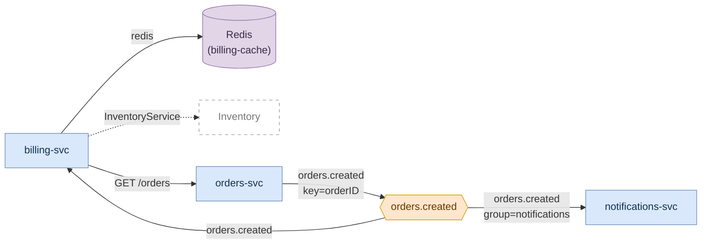

# Micro topology - `billing-svc`

> **Real output**, from [`fixture-mesh/`](fixture-mesh/). See
> [`sample-master-topology.md`](sample-master-topology.md) for the whole system;
> this is the same model, narrowed to one service.

**Service root:** `services/billing`
**Language:** python
**Declared in:** `services/billing/pyproject.toml:2`
**Open in your editor:** `service-topology/micro/billing-svc.drawio`

| | |
|---|---|
| Inbound edges | 1 |
| Outbound edges | 3 |
| Nodes | 6 (master has 9) |
| Edges | 6 (master has 10) |
| Confirmed `[CODE]` | 5 |
| Inferred | 1 |

---

## The diagram

Three differences from the master are worth pointing at:

1. **It is a strict subset.** Six nodes of nine, six edges of ten. Stripe,
   PostgreSQL, and `notifications.sent` are gone - `billing-svc` does not touch
   them.
2. **Kafka gets two hops, everything else gets one.** `orders-svc` and
   `notifications-svc` appear even though `billing-svc` has no direct edge to
   the latter, because both sit on the other end of `orders.created`. A topic in
   isolation tells you nothing; who else is on it is the whole question.
3. **Kafka edges gain the topic name.** In the master the topic is the box next
   door; here the arrow carries `orders.created` as well, because a micro
   topology is meant to be reviewable without cross-referencing anything.

---

## Inbound

### Topics it consumes

| Topic | Consumer group | Also produced by | Read at |
|---|---|---|---|
| `orders.created` | not visible - `group_id=GROUP_ID`, a variable | `orders-svc` | `services/billing/billing/consumers.py:12` |

### Services that call it

None. Nothing in this repository calls `billing-svc` - it is a pure consumer.

---

## Outbound

### Topics it produces

None. `billing-svc` consumes and never publishes, which is worth knowing: an
invoice failure is invisible to the rest of the system.

### Services it calls

| Target | Protocol | Endpoint | Evidence | Read at |
|---|---|---|---|---|
| `orders-svc` | http | `GET /orders` | `[CODE]` | `services/billing/billing/orders_client.py:12` |
| `inventory` | grpc | `InventoryService` | `[INFERENCE]` | `services/billing/billing/inventory.py:14` |

The `orders-svc` edge is `[CODE]` through two files, not one: the call site
reads `os.environ["ORDERS_SERVICE_URL"]`, and `docker-compose.yml:18` sets that
to `http://orders-svc:8080`. Both ends were read, so the binding is direct.

### External systems

| System | Kind | Protocol | Read at |
|---|---|---|---|
| `billing-cache` | cache (Redis) | redis | `docker-compose.yml:15`, also `docker-compose.yml:20`, `services/billing/billing/cache.py:5` |

---

## Blast radius

| If this changes | These break | Confidence |
|---|---|---|
| `orders.created` payload or key | `billing-svc` invoicing | `[CODE]` |
| `orders-svc`'s `GET /orders/{id}` response shape | `billing-svc` cannot enrich the invoice - the event alone does not carry the order | `[CODE]` |
| `InventoryService.Reserve` signature | Stock reservation, probably | `[INFERENCE]` - confirm before relying on this row |

`billing-svc` produces nothing, so nothing downstream breaks when *it* changes.
That asymmetry is the useful output of a micro topology: this service is a
consumer of three contracts and the owner of none.

---

## Inferred, not confirmed

| Edge | Why | What would confirm it |
|---|---|---|
| `billing-svc` → `inventory` | A generated gRPC client stub for `InventoryService` is used at `services/billing/billing/inventory.py:14`, but no `.proto` declaring that service was found in scope | Bring the `.proto` into scope, or point `--scope` at the repository that holds it. If a server registration for it is then found, the edge becomes `[CODE]` |

---

## What this diagram does not show

- **Two hops only.** What `orders-svc` calls, and what `notifications-svc`
  publishes, are outside this frame. Use the master topology for that.
- **The consumer group**, because the code reads it from a variable.
- **Which `orders-svc` endpoint is really being called.** The URL is assembled
  by concatenation, so only the literal `"/orders/"` fragment is recoverable;
  the trailing id is a runtime value and is not invented.
- **Anything about the `inventory` service's own inside.** It is
  referenced-only - drawn hollow, and given no micro topology of its own,
  because there is nothing here to draw.
